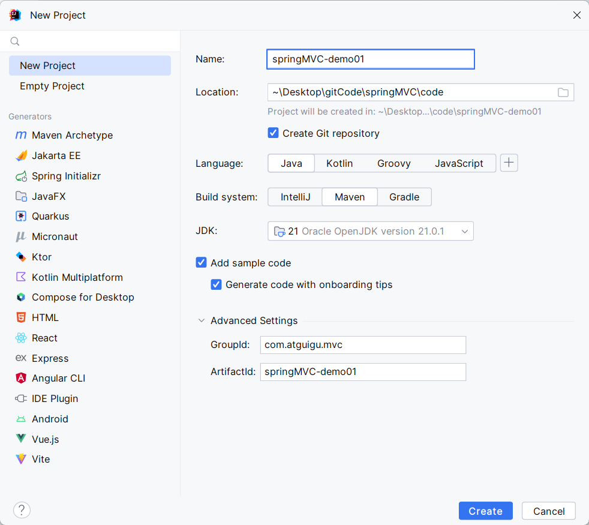
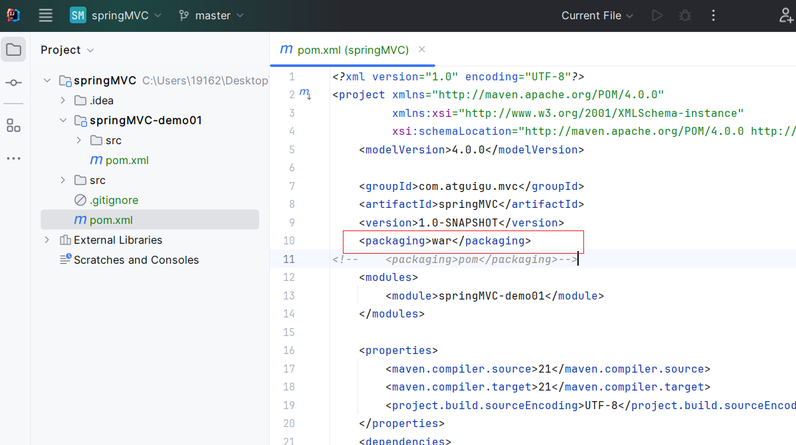
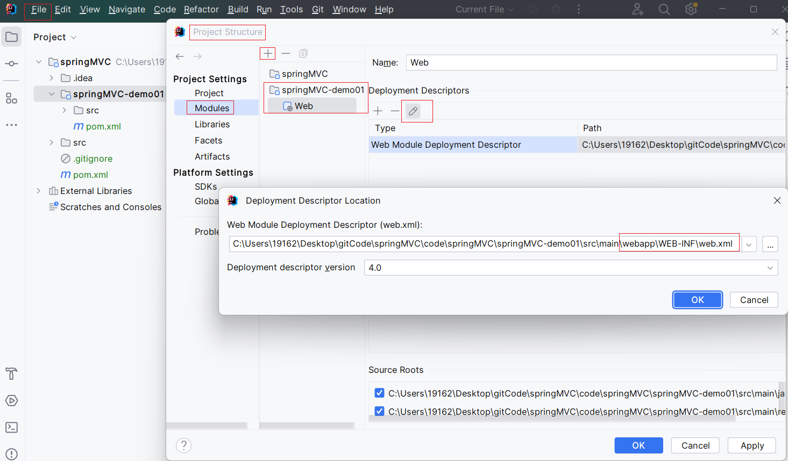
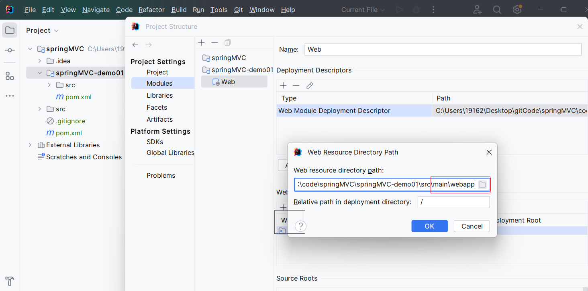

# 一、SpringMVC简介

### 1、什么是MVC

MVC是一种软件架构的思想，将软件按照模型、视图、控制器来划分

M：Model，模型层，指工程中的JavaBean，作用是处理数据

JavaBean分为两类：

- 一类成为实体类Bean：专门存储业务数据的，如Student、User等
- 一类称为业务处理Bean：指Service或Dao对象，专门用于处理业务逻辑和数据访问。

V：View，视图层，指工程中的html或jsp等页面，作用是与用户进行交互，展示数据

C：Controller，控制层，指工程中的servlet，作用是接收和响应浏览器

MVC的工作流程：

用户通过视图层发送请求到服务器，在服务器中请求Controller接收，Controller调用相应的Model层处理请求，处理完毕将结果返回到Controller，Controller再根据请求处理的结果找到相应的View视图，渲染数据后最终响应给浏览器

### 2、什么是SpringMVC

SpringMVC是Spring的一个后续产品，是一个子项目

SpringMVC是Spring为表述层开发提供的一套完备的解决方案。在表述层框架历经Struct、WebWork、Struct2等诸多产品的历代更迭之后，目前业界普遍选择了SpringMVC作为JavaEE项目表述层开发的**首选方案**。

> 注：三层架构分为表述层（或表示层）、业务逻辑层、数据访问层，表述层表示前台页面和后台servlet


servlet：init、service、destory三个周期：

1. 请求地址找到servlet
2. service：处理请求和响应
   1. 在过滤器中，设置编码
   2. 获取请求参数
   3. 根据返回结果做不同处理
      1. 比如查询结果放到指定的域对象中
      2. 记录登录成功，放到session中
   4. 根据service处理后的结果响应浏览器

### 3、SpringMVC的特点

- **Spring家族原生产品**，与IOC容器等基础设施无缝对接
- **基于原生的Servlet**，通过了功能强大的**前端控制器DispatcherServlet**，对请求和响应进行统一处理
- 表述层各细分领域需要解决的问题**全方位覆盖**，提供**全面解决方案**
- **代码清晰简洁**，大幅度提升开发效率
- 内部组件化程度高，可插拔式组件**即插即用**，想要什么功能配置相应组件即可
- **性能卓著**，尤其适合现代大型、超大型互联网项目要求


# 二、HelloWorld

### 1、开发环境

IDE：idea 2023.2.4

构建工具：maven 3.9.9

服务器：tomcat10

Spring版本：6

jdk：21

### 2、创建maven工程

1、创建父工程springMVC，修改maven版本，创建子模块



2、

#### a、打包方式war



3、

#### b、导入依赖

```
<dependencies>
    <!-- https://mvnrepository.com/artifact/org.springframework/spring-webmvc -->
    <dependency>
        <groupId>org.springframework</groupId>
        <artifactId>spring-webmvc</artifactId>
        <version>6.1.12</version>
    </dependency>

    <!-- 日志
    https://mvnrepository.com/artifact/ch.qos.logback/logback-classic -->
    <dependency>
        <groupId>ch.qos.logback</groupId>
        <artifactId>logback-classic</artifactId>
        <version>1.5.12</version>
        <!--            <scope>test</scope>-->
    </dependency>

    <!-- https://mvnrepository.com/artifact/javax.servlet/javax.servlet-api
     当前使用的tomcat10不能使用这个javax.servlet-->
<!--        <dependency>-->
<!--            <groupId>javax.servlet</groupId>-->
<!--            <artifactId>javax.servlet-api</artifactId>-->
<!--            <version>4.0.1</version>-->
<!--            <scope>provided</scope>-->
<!--        </dependency>-->

    <!-- https://mvnrepository.com/artifact/jakarta.servlet/jakarta.servlet-api -->
    <dependency>
        <groupId>jakarta.servlet</groupId>
        <artifactId>jakarta.servlet-api</artifactId>
        <version>6.0.0</version>
        <scope>provided</scope>
    </dependency>


    <!-- https://mvnrepository.com/artifact/org.thymeleaf/thymeleaf-spring6 -->
    <dependency>
        <groupId>org.thymeleaf</groupId>
        <artifactId>thymeleaf-spring6</artifactId>
        <version>3.1.2.RELEASE</version>
    </dependency>

</dependencies>
```

4、

#### c、添加web模块





### 3、配置web.xml

<<<<<<< HEAD
注册SpringMVC的前端控制器DispatcherServlet

#### a、**默认配置方式**

此配置作用下，SpringMVC的配置文件默认位于WEB-INF下，默认名称为<servlet-name>-servlet.xml，例如，以下配置所对应SpringMVC的配置文件位于WEB-INF下，文件名为springMVC-servlet.xml

```
<!-- 配置springMVC的前端控制器，对浏览器发送的请求进行统一处理 -->
<servlet>
    <servlet-name>SpringMVC</servlet-name>
    <servlet-class>org.springframework.web.servlet.DispatcherServlet</servlet-class>
</servlet>

<servlet-mapping>
    <servlet-name>SpringMVC</servlet-name>
    <!-- 设置springMVC的核心控制器所能处理的请求的请求路径
    所匹配的请求可以是/login或.htm1或.js或.css方式的请求路径
    但是/不能匹配.jsp请求路径的请求
    /*包括所有包括.jsp请求
    -->
    <url-pattern>/</url-pattern>
</servlet-mapping>
```

#### b、扩展配置方式

可通过init-param标签设置SpringMVC配置文件的位置和名称，通过load-on-startup标签设置SpringMVC前端控制器DispatcherServlet的初始化时间

```
<!-- 配置springMVC的前端控制器，对浏览器发送的请求进行统一处理 -->
<servlet>
    <servlet-name>SpringMVC</servlet-name>
    <servlet-class>org.springframework.web.servlet.DispatcherServlet</servlet-class>
    <!-- 配置SpringMVC配置文件的位置和名称 -->
    <init-param>
        <!-- contextConfigLocation为固定值 -->
        <param-name>contextConfigLocation</param-name>
        <!-- 使用classpath:表示从类路径査找配置文件，例如maven工程中的src/main/resources -->
        <param-value>classpath:springMVC.xml</param-value>
    </init-param>
    <!-- 作为框架的核心组件，在启动过程中有大量的初始化操作要做而这些
    操作放在第一次请求时才执行会严重影响访问速度因此需要通过此标签将启动
    控制DispatcherServlet的初始化时间提前到服务器启动时-->
    <load-on-startup>1</load-on-startup>
</servlet>

<servlet-mapping>
    <servlet-name>SpringMVC</servlet-name>
    <!-- 设置springMVC的核心控制器所能处理的请求的请求路径
    所匹配的请求可以是/login或.htm1或.js或.css方式的请求路径
    但是/不能匹配.jsp请求路径的请求
    -->
    <url-pattern>/</url-pattern>
</servlet-mapping>
```

> 注：
>
> <url-pattern>标签中使用/和/*的区别:*
>
> *(所匹配的请求可以是/login或.html或.js或.css方式的请求路径，但是/不能匹配.jsp请求路径的请求*
>
> *因此就可以避免在访问isp页面时，该请求被DispatcherServet处理，从而找不到相应的页面*
>
> */*则能够匹配所有请求，例如在使用过滤器时，若需要对所有请求进行过滤，就需要使用/*的写法


### 4、创建请求控制器

由于前端控制器对浏览器发送的请求进行了统一的处理，但是具体的请求有不同的处理过程，因此需要创建处理具
体请求的类，即请求控制器

请求控制器中每一个处理请求的方法成为控制器方法

因为SpringMVC的控制器由一个POJO(普通的java类)担任，因此需要通过@Controller注解将其标识为一个控制层组件，交给Spring的loC容器管理，此时SpringMVC才能够识别控制器的存在

```
package com.atguigu.mvc.controller;

import org.springframework.stereotype.Controller;

@Controller
public class HelloController {
}
```
=======
注册springMVC的前端控制器DispatcherServlet

#### a、默认配置方式


>>>>>>> f667a291244c1affe38b58d5f46fe2ab79a79118

