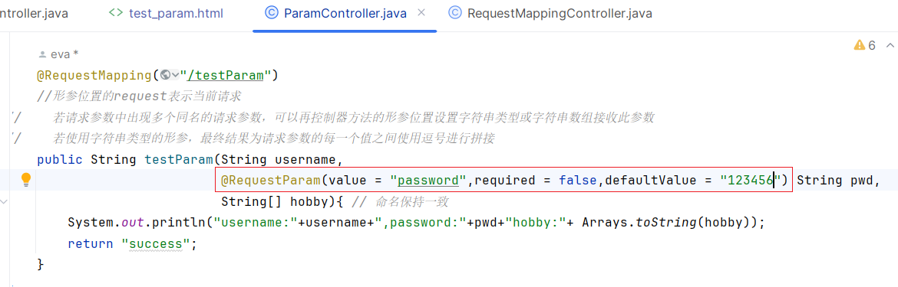
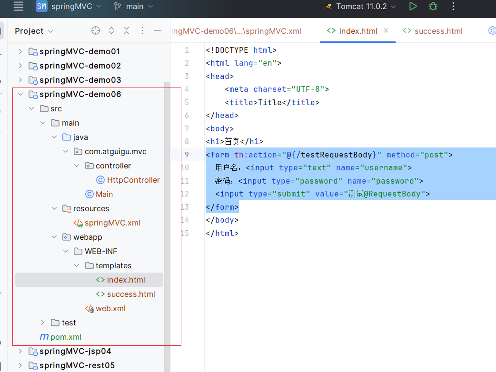
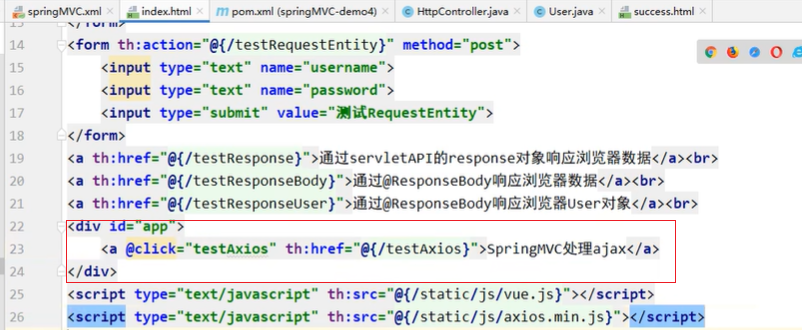

# 一、SpringMVC简介

### 1、什么是MVC

MVC是一种软件架构的思想，将软件按照模型、视图、控制器来划分

M：Model，模型层，指工程中的JavaBean，作用是处理数据

JavaBean分为两类：

- 一类成为实体类Bean：专门存储业务数据的，如Student、User等
- 一类称为业务处理Bean：指Service或Dao对象，专门用于处理业务逻辑和数据访问。

V：View，视图层，指工程中的html或jsp等页面，作用是与用户进行交互，展示数据

C：Controller，控制层，指工程中的servlet，作用是接收和响应浏览器

MVC的工作流程：

用户通过视图层发送请求到服务器，在服务器中请求Controller接收，Controller调用相应的Model层处理请求，处理完毕将结果返回到Controller，Controller再根据请求处理的结果找到相应的View视图，渲染数据后最终响应给浏览器

### 2、什么是SpringMVC

SpringMVC是Spring的一个后续产品，是一个子项目

SpringMVC是Spring为表述层开发提供的一套完备的解决方案。在表述层框架历经Struct、WebWork、Struct2等诸多产品的历代更迭之后，目前业界普遍选择了SpringMVC作为JavaEE项目表述层开发的**首选方案**。

> 注：三层架构分为表述层（或表示层）、业务逻辑层、数据访问层，表述层表示前台页面和后台servlet


servlet：init、service、destory三个周期：

1. 请求地址找到servlet
2. service：处理请求和响应
   1. 在过滤器中，设置编码
   2. 获取请求参数
   3. 根据返回结果做不同处理
      1. 比如查询结果放到指定的域对象中
      2. 记录登录成功，放到session中
   4. 根据service处理后的结果响应浏览器

### 3、SpringMVC的特点

- **Spring家族原生产品**，与IOC容器等基础设施无缝对接
- **基于原生的Servlet**，通过了功能强大的**前端控制器DispatcherServlet**，对请求和响应进行统一处理
- 表述层各细分领域需要解决的问题**全方位覆盖**，提供**全面解决方案**
- **代码清晰简洁**，大幅度提升开发效率
- 内部组件化程度高，可插拔式组件**即插即用**，想要什么功能配置相应组件即可
- **性能卓著**，尤其适合现代大型、超大型互联网项目要求


# 二、HelloWorld

### 1、开发环境

IDE：idea 2023.2.4

构建工具：maven 3.9.9

服务器：tomcat 11.0.2 （主要是支持java21）

Spring版本：6

jdk：21

### 2、创建maven工程

1、创建父工程springMVC，修改maven版本，创建子模块


2、配置打包方式


3、导入依赖

```
<dependencies>
    <!-- https://mvnrepository.com/artifact/org.springframework/spring-webmvc -->
    <dependency>
        <groupId>org.springframework</groupId>
        <artifactId>spring-webmvc</artifactId>
        <version>6.1.12</version>
    </dependency>

    <!-- 日志
    https://mvnrepository.com/artifact/ch.qos.logback/logback-classic -->
    <dependency>
        <groupId>ch.qos.logback</groupId>
        <artifactId>logback-classic</artifactId>
        <version>1.5.12</version>
        <!--            <scope>test</scope>-->
    </dependency>

    <!-- https://mvnrepository.com/artifact/javax.servlet/javax.servlet-api
     当前使用的tomcat10不能使用这个javax.servlet-->
<!--        <dependency>-->
<!--            <groupId>javax.servlet</groupId>-->
<!--            <artifactId>javax.servlet-api</artifactId>-->
<!--            <version>4.0.1</version>-->
<!--            <scope>provided</scope>-->
<!--        </dependency>-->

    <!-- https://mvnrepository.com/artifact/jakarta.servlet/jakarta.servlet-api -->
    <dependency>
        <groupId>jakarta.servlet</groupId>
        <artifactId>jakarta.servlet-api</artifactId>
        <version>6.0.0</version>
        <scope>provided</scope>
    </dependency>


    <!-- https://mvnrepository.com/artifact/org.thymeleaf/thymeleaf-spring6 -->
    <dependency>
        <groupId>org.thymeleaf</groupId>
        <artifactId>thymeleaf-spring6</artifactId>
        <version>3.1.2.RELEASE</version>
    </dependency>

</dependencies>
```

4、添加web模块


### 3、配置web.xml

注册SpringMVC的前端控制器DispatcherServlet

#### a、**默认配置方式**

此配置作用下，SpringMVC的配置文件默认位于WEB-INF下，默认名称为<servlet-name>-servlet.xml，例如，以下配置所对应SpringMVC的配置文件位于WEB-INF下，文件名为springMVC-servlet.xml

```
<!-- 配置springMVC的前端控制器，对浏览器发送的请求进行统一处理 -->
<servlet>
    <servlet-name>SpringMVC</servlet-name>
    <servlet-class>org.springframework.web.servlet.DispatcherServlet</servlet-class>
</servlet>

<servlet-mapping>
    <servlet-name>SpringMVC</servlet-name>
    <!-- 设置springMVC的核心控制器所能处理的请求的请求路径
    所匹配的请求可以是/login或.htm1或.js或.css方式的请求路径
    但是/不能匹配.jsp请求路径的请求
    /*包括所有包括.jsp请求
    -->
    <url-pattern>/</url-pattern>
</servlet-mapping>
```

#### b、扩展配置方式

可通过init-param标签设置SpringMVC配置文件的位置和名称，通过load-on-startup标签设置SpringMVC前端控制器DispatcherServlet的初始化时间

```
<!-- 配置springMVC的前端控制器，对浏览器发送的请求进行统一处理 -->
<servlet>
    <servlet-name>SpringMVC</servlet-name>
    <servlet-class>org.springframework.web.servlet.DispatcherServlet</servlet-class>
    <!-- 配置SpringMVC配置文件的位置和名称 -->
    <init-param>
        <!-- contextConfigLocation为固定值 -->
        <param-name>contextConfigLocation</param-name>
        <!-- 使用classpath:表示从类路径査找配置文件，例如maven工程中的src/main/resources -->
        <param-value>classpath:springMVC.xml</param-value>
    </init-param>
    <!-- 作为框架的核心组件，在启动过程中有大量的初始化操作要做而这些
    操作放在第一次请求时才执行会严重影响访问速度因此需要通过此标签将启动
    控制DispatcherServlet的初始化时间提前到服务器启动时-->
    <load-on-startup>1</load-on-startup>
</servlet>

<servlet-mapping>
    <servlet-name>SpringMVC</servlet-name>
    <!-- 设置springMVC的核心控制器所能处理的请求的请求路径
    所匹配的请求可以是/login或.htm1或.js或.css方式的请求路径
    但是/不能匹配.jsp请求路径的请求
    -->
    <url-pattern>/</url-pattern>
</servlet-mapping>
```

> 注：
>
> <url-pattern>标签中使用/和/*的区别:*
>
> *(所匹配的请求可以是/login或.html或.js或.css方式的请求路径，但是/不能匹配.jsp请求路径的请求*
>
> *因此就可以避免在访问isp页面时，该请求被DispatcherServet处理，从而找不到相应的页面*
>
> */*则能够匹配所有请求，例如在使用过滤器时，若需要对所有请求进行过滤，就需要使用/*的写法


### 4、创建请求控制器

由于前端控制器对浏览器发送的请求进行了统一的处理，但是具体的请求有不同的处理过程，因此需要创建处理具
体请求的类，即请求控制器

请求控制器中每一个处理请求的方法成为控制器方法

因为SpringMVC的控制器由一个POJO(普通的java类)担任，因此需要通过@Controller注解将其标识为一个控制层组件，交给Spring的loC容器管理，此时SpringMVC才能够识别控制器的存在


```
package com.atguigu.mvc.controller;

import org.springframework.stereotype.Controller;

@Controller
public class HelloController {
}
```

### 5、创建配置springMVC的配置文件

```
<?xml version="1.0" encoding="UTF-8"?>
<beans xmlns="http://www.springframework.org/schema/beans"
       xmlns:xsi="http://www.w3.org/2001/XMLSchema-instance"
       xmlns:context="http://www.springframework.org/schema/context"
       xmlns:mvc="http://www.springframework.org/schema/mvc"
       xsi:schemaLocation="http://www.springframework.org/schema/beans
        http://www.springframework.org/schema/beans/spring-beans.xsd
        http://www.springframework.org/schema/context
        https://www.springframework.org/schema/context/spring-context.xsd
        http://www.springframework.org/schema/mvc
        https://www.springframework.org/schema/mvc/spring-mvc.xsd">


    <!-- 扫描组件 -->
    <context:component-scan base-package="com.atguigu.mvc.controller"/>

    <!-- 配置thymeleaf视图解析器 -->
    <!-- Configure Thymeleaf template resolver -->
    <bean id="templateResolver" class="org.thymeleaf.spring6.templateresolver.SpringResourceTemplateResolver">
        <property name="prefix" value="/WEB-INF/templates/" />
        <property name="suffix" value=".html" />
        <property name="templateMode" value="HTML" />
        <property name="characterEncoding" value="UTF-8" />
        <!-- 其他可选配置，如cacheable等 -->
    </bean>
    <!-- Configure Thymeleaf template engine -->
    <bean id="templateEngine" class="org.thymeleaf.spring6.SpringTemplateEngine">
        <property name="templateResolver" ref="templateResolver" />
        <!-- 其他可选配置，如additionalDialects, additionalEngines等 -->
    </bean>
    <bean id="viewResolver" class="org.thymeleaf.spring6.view.ThymeleafViewResolver">
        <property name="order" value="1"/>
        <property name="templateEngine" ref="templateEngine" />
        <property name="characterEncoding" value="UTF-8" />
        <!-- 其他可选配置，如contentType, order等 -->
    </bean>

</beans>
```

没有用上的部分笔记：


### 6、测试HelloWorld

#### a、实现对首页的访问

在请求控制器中创建处理请求的方法

```
//@RequestMapping注解：处理请求和控制器方法之间的映射关系
//@RequestMapping注解的va1ue属性可以通过请求地址匹配请求，/表示的当前工程的上下文路径
//localhost:8080/springMvc/
@RequestMapping("/")
public String index(){
//    设置视图名称
    return "index";
}
```

```
package com.atguigu.mvc.controller;

import org.springframework.stereotype.Controller;
import org.springframework.web.bind.annotation.RequestMapping;

/**
 * @Description: 实际代码
 * @Author Eva
 * @Date 2024/12/30 22:45
 */

@Controller
public class HelloController {
//    "/"-->/WEB-INF/template/index.html
    @RequestMapping(value = "/")
    public String index(){
//        返回视图名称
        return "index";
    }
}
```


#### b、通过超链接跳转到指定页面

```
<!DOCTYPE html>
<html lang="en" xmlns:th="www.thymeleaf.org">
<head>
    <meta charset="UTF-8">
    <title>首页</title>
</head>
<body>
<h1>首页</h1>
<p>href="/target"<br>
    少一个上下文路径：/springMVC，由于可以改，每次上下文路径修改则代码就会变
    不使用下面方法，会直接访问localhost:8080<br>
    使用thymeaf语法解析属性，下面是格式，自动添加上下文路径
</p>
<a th:href="@{/target}">访问目标页面target.html</a>
</body>
</html>
```


最后：


### 7、总结

浏览器发送请求，若请求地址符合前端控制器的url-pattern，该请求就会被前端控制器DispatcherServlet处理前端控制器会读取SpringMVC的核心配置文件，通过扫描组件找到控制器，将请求地址和控制器中@RequestMapping注解的value属性值进行匹配，若匹配成功，该注解所标识的控制器方法就是处理请求的方法。处理请求的方法需要返回一个字符串类型的视图名称，该视图名称会被视图解析器解析，加上前缀和后缀组成视图的路径，通过Thymeleaf对视图进行消染，最终转发到视图所对应页面

---

重新创建模块：

1、和demo01创建方式一样


2、引入依赖，和demo01一样


3、在web.xml注册前端控制器。先将当前的maven工程添加web模块


4、注册DispatcherServlet前端控制器


5、添加spring的配置文件


6、访问首页，web-inf的页面

标识为控制层组件


扫描组件


配置视图解析器


根据视图解析器的前后缀，创建目录和首页


控制器中写方法，访问首页

浏览器发送请求 - > DispatcherServlet解析地址和控制器方法中的request-mapping使用的属性值匹配 ->根据返回的名称返回视图名称 ->视图解析器解析，加入前后缀 ->找到页面，返回页面


配置tomcat


# 三、RequestMapping注解

### 1、@RequestMapping注解的功能

从注解名称上我们可以看到，@RequestMapping注解的作用就是将请求和处理请求的控制器方法关联起来，建立
映射关系。

SpringMVC 接收到指定的请求，就会来找到在映射关系中对应的控制器方法来处理这个请求。

### 2、@RequestMapping注解的位置

```
@Controller
@RequestMapping("/hello")
public class RequestMappingController {

    @RequestMapping("/testRequestMapping")
    public String success(){
        return "sucess";
    }
}
```

环境：


@RequestMapping标识一个类：设置映射请求的请求路径的初始信息


@RequestMapping标识一个方法：设置映射请求请求路径的具体信息


重复会报错：


### 3、@RequestMapping注解value的属性

@RequestMapping注解的value属性通过请求的请求地址匹配请求映射

@RequestMapping注解的value属性是一个字符串类型的数组，表示该请求映射能够匹配多个请求地址所对应的请求

@RequestMapping注解的value属性必须设置，至少通过请求地址匹配请求映射

```
<a th:href="@{/hello/testRequestMapping}">测试RequestMapping注解的value属性 ->/testRequestMapping</a><br>
<a th:href="@{/hello/test}">测试RequestMapping注解的value属性 ->/test</a><br>
```

```
@RequestMapping(
        value = {"/testRequestMapping","/test"}
)
public String success(){
    return "sucess";
}
```


测试：


查看属性的方法：


### 4、@RequestMapping注解method的属性

@RequestMapping注解的method属性通过请求的请求方式(get或post)匹配请求映射

@RequestMapping注解的method属性是一个RequestMethod类型的数组，表示该请求映射能够匹配多种请求方式的请求

若当前请求的请求地址满足请求映射的value属性，但是请求方式不满足method属性，则浏览器报错405:Request method 'POST' not supported

```
<form th:action = "@{/test}" method="post">
    <input type="submit" value="测试RequestMapping注解的method属性 ->post">
</form>
```

```
@RequestMapping(
        value = {"/testRequestMapping","/test"},
//            不写下面的method，则
        method = {RequestMethod.GET, RequestMethod.POST}
)
public String success(){
    return "sucess";
}
```

> 注
> 1、对于处理指定请求方式的控制器方法，SpringMVC中提供了@RequestMapping的派生注解
>
> 处理get请求的映射-->@GetMapping
> 处理post请求的映射-->@PostMapping
> 处理put请求的映射-->@PutMapping
> 处理delete请求的映射->@DeleteMapping
>
> 2、常用的请求方式有get，post，put，delete
>
> 但是目前浏览器只支持get和post，若在form表单提交时，为method设置了其他请求方式的字符申(put或delete)，则按照默认的请求方式get处理
>
> 若要发送put和delete请求，则需要通过spring提供的过滤器HiddenHttpMethodfilter，在restful部分会讲到


### 5、@RequestMapping注解params的属性(了解)

@RequestMapping注解的params属性通过请求的请求参数匹配请求映射

@RequestMapping注解的params属性是一个字符串类型的数组，可以通过四种表达式设置请求参数和请求映射的匹配关系
"param":要求请求映射所匹配的请求必须携带param请求参数

"!param":要求请求映射所匹配的请求必须不能携带param请求参数

"param=value":要求请求映射所匹配的请求必须携带param请求参数目param=value

"param!=value”:要求请求映射所匹配的请求必须携带param请求参数但是param!=value

```
<a th:href="@{/testParamsAndHeaders(username='admin',password=12345)}">测试RequestMapping的params属性 -->/testParamsAndHeaders</a><br>
```

```
@RequestMapping(
        value = "/testParamsAndHeaders",
        params = {"username","password=12345"} // params = {"!username","password!=12345"} 代表不能有username和...
)
public String testParamsAndHeaders(){
    return "success";
}
```

> 注:
> 若当前请求满足@RequestMapping注解的value和method属性，但是不满足params属性，此时页面回报错400: Parameter conditions "username, password!=123456" not met for actual request parameters:username={admin}, password={123456}

### 6、@RequestMapping注解header的属性(了解)

> @RequestMapping注解的headers属性通过请求的请求头信息匹配请求映射
>
> @RequestMapping注解的headers属性是一个字符串类型的数组，可以通过四种表达式设置请求头信息和请求映射的匹配关系
> "header":要求请求映射所匹配的请求必须携带header请求头信息
>
> "!header":要求请求映射所匹配的请求必须不能携带header请求头信息
>
> "header=value":要求请求映射所匹配的请求必须携带header请求头信息且header=value
>
> "header!=value”:要求请求映射所匹配的请求必须携带header请求头信息目header!=value
>
> 若当前请求满足@RequestMapping注解的value和method属性，但是不满足headers属性，此时页面显示404错误，即资源未找到


### 7、SpringMVC支持ant风格的路径

? ：表示任意的单个字符

*：表示任意的0个或多个字符

**：表示任意的一层或多层目录

注意：在使用\*\*时，只能使用/**/xxx的方式


### 8、SpringMVC支持路径中的占位符(重点)

原始方式：/deleteUser?id=1

rest方式：/deleteUser/1

SpringMVC路径中的占位符常用于restful风格中，当请求路径中将某些数据通过路径的方式传输到服务器中，就可以在相应的@RequestMapping注解的value属性中通过占位符{xxx)表示传输的数据，在通过@PathVariable注解，将占位符所表示的数据赋值给控制器方法的形参

```
<a th:href="@{/testRest/1/admin}">测试路径中的占位符-->/testRest</a><br>
```

```
@RequestMapping("/testPath/{id}/{username}") // "/a**a/testAnt" 这样写是错的
public String testPath(@PathVariable("id")Integer id,@PathVariable("username")String username){
    System.out.println("id:"+id);
    System.out.println("username:"+username);
    return "success";
}
```


## 四、SpringMVC获取请求参数

### 1、通过ServletAPI获取

将HttpServletRequest作为控制器方法的形参，此时HttpServletRequest类型的参数表示封装了当前请求的请求
报文的对象

```
@RequestMapping("/testServletAPI")
//形参位置的request表示当前请求
public String testServletAPI(HttpServletRequest request){
    String username = request.getParameter("username");
    String pwd = request.getParameter("pwd");
    System.out.println("username:"+username+",password:"+pwd);
    return "success";
}
```


### 2、通过控制器方法的参数获取

在控制器方法的形参位置，设置和请求参数同名的形参，当浏览器发送请求，匹配到请求映射时，在DispatcherServlet中就会将请求参数赋值给相应的形参

```
<a th:href="@{/testParam(username='admin',pwd=123456)}">测试使用控制器的形参获取请求参数</a>
```

```
@RequestMapping("/testParam")
//形参位置的request表示当前请求
public String testParam(String username,String pwd){ // 命名保持一致
    System.out.println("username:"+username+",password:"+pwd);
    return "success";
}
```

> 注:
> 若请求所传输的请求参数中有多个同名的谓求参数，此时可以在控制器方法的形参中设置字符串数组或者字符串类型的形参接收此请求参数
> 若使用字符串数组类型的形参，此参数的数组中包含了每一个数据若使用字符串类型的形参，此参数的值为每个数据中间使用逗号拼接的结果

### 3、@RequestParam

@RequestParam是将请求参数和控制器方法的形参创建映射关系

@RequestParam注解一共有三个属性:

value：指定为形参赋值的请求参数的参数名

required：设置是否必须传输此请求参数，默认值为true

若设置为true时，则当前请求必须传输value所指定的请求参数，若没有传输该请求参数，且没有设置defaultValue属性，则页面报错400：Required String parameter'xxx'is not present；若设置为false，则当前请求不是必须传输value所指定的请求参数，若没有传输，则注解所标识的形参的值为null

defaultValue：不管required属性值为true或false，当value所指定的请求参数没有传输的值为“”时，则使用默认值为形参赋值




### 4、@RequestHeader

@RequestHeader是将请求头信息和控制器方法的形参创建映射关系

@RequestHeader注解一共有三个属性：value、required、defaultValue，用法同@RequestParam


### 5、@CookieValue

@CookieValue是将cookie数据和控制器方法的形参创建映射关系

@CookieValue注解一共有三个属性:value、required、defaultValue，用法同@RequestParam


遇到的问题：


解决方案：上上图大红框的部分


两种会话依赖技术？

session依赖cookie；session是服务端的会话技术、cookie是客户端的；cookie的生命周期是浏览器的开启到关闭；第一次请求，getSession()方法会校验请求报文请求是否携带jsessionID中的cookie，没有，第一次创建session对象：创建HTTPSession对象，session放在服务器所维护的map集合中，并且创建一个cookie，cookie的键是固定的是jsessionID，值是一个随机序列，常说的UUID，将HTTPSession对象放在服务器所维护的map集合中，这个随机序列作为map集合的键，session对象作为map集合的值来存储在服务器的内部，cookie响应到浏览器

### 6、通过POJO获取请求参数

可以在控制器方法的形参位置设置一个实体类类型的形参，此时若浏览器传输的请求参数的参数名和实体类中的属性名一致，那么请求参数就会为此属性赋值

```
<form th:action="@{/testBean}" method="post">
    用户名：<input type="text" name="username"><br>
    密码：<input type="password" name="password"><br>
    性别：<input type="radio" name="sex" value="女">女<input type="radio" name="sex" value="男">男<br>
    年龄：<input type="text" name="age"><br>
    邮箱：<input type="text" name="email"><br>
    <input type="submit" value="使用实体类接收请求参数">
</form>
```

```
@RequestMapping("/testBean")
public String testBean(User user){
    System.out.println(user);
    return "success";
}
```


### 7、解决获取请求参数的乱码问题

新版本没有乱码问题！

**会遇到新问题**，就是下列的init-param加上后会报错，所以后面删除了

解决获取请求参数的乱码问题，可以使用SpringMVC提供的编码过滤器CharacterEncodingFilter，但是必须在web.xml中进行注册

```
<!-- 配置SpringMVC的编码过滤器 -->
<filter>
    <filter-name>CharacterEncodingFilter</filter-name>
    <filter-class>org.springframework.web.filter.CharacterEncodingFilter</filter-class>
    <init-param>
        <param-name>encoding</param-name>
        <param-value>UTF-8</param-value>
    </init-param>
    <init-param>
        <param-name>forceResponseEncoding</param-name>
        <param-value>UTF-8</param-value>
    </init-param>
</filter>
<filter-mapping>
    <filter-name>CharacterEncodingFilter</filter-name>
    <url-pattern>*/</url-pattern>
</filter-mapping>
```

> 注:
> SpringMVC中处理编码的过滤留一定要配置到其他过滤留之前，否则无效

使用springMVC自带的编码过滤器，注册在web.xml上就行。这里涉及到设置的位置，为什么设置在filter上，servletContext -> filter -> servlet

---

前置准备：


前置知识：

数据需要发送到页面，需要将这些数据在域对象中共享。

四个域对象：

一、ServletContext 

1、生命周期：当Web应用被加载进容器时创建代表**整个web应用**的ServletContext对象，当服务器关闭或Web应用被移除时，ServletContext对象跟着销毁。 

**服务器的开启和关闭**

2、作用范围：整个Web应用（应用范围）。

二、HttpSession 

1、生命周期：（会话范围）在第一次调用 request.getSession() 方法时，服务器会检查是否已经有对应的session,如果没有就在内存 中创建一个session并返回。 

浏览器开启和浏览器关闭，和服务器没有关系，因为有
**钝化和活化**：服务器关闭，浏览器未关闭

2、作用范围：一次会话。

三、ServletRequest 

1、生命周期：在**service 方法调用**前由服务器创建，传入service方法。整个请求结束，request生命结束。 

**一次请求**

2、作用范围：（请求范围）整个请求链（请求转发也存在）。

四、PageContext 

用的少

1、生命周期：当对JSP的请求时开始，当响应结束时销毁。 

2、作用范围：（页面范围）整个JSP页面，是四大作用域中最小的一个


知识点：


前置准备：

1. 新建springMVC-demo03
2. 复制依赖的pom.xml
3. 添加web.xml，并配置，与demo02一样
4. 创建package com.atguigu.mvc.controller.TestController
5. 添加并配置springMVC.xml
6. 创建index.html首页
7. 在TestController配置请求映射

问题：少复制了东西，导致初始失败


## 五、域对象共享数据

### 1、使用servletAPI向request域对象共享数据

```
//    使用servletAPI向request域对象共享数据
@RequestMapping("testRequestByServletAPI")
public String testRequestByServletAPI(HttpServletRequest request){
    request.setAttribute("testRequestScope","hello,servletAPI");
    return "success";
}
```

### 2、使用ModelAndView向request域对象共享数据

```
/**
 * 重要：无论用什么方式最终都会把数据包装成ModelAndView
 * ModelAndView有Model和View的功能
 * Model主要用于向请求域共享数据
 * View主要用于设置视图，实现页面跳转
 */
@RequestMapping("testModelAndView")
public ModelAndView testModelAndView(){
    ModelAndView mav = new ModelAndView();
//        回顾：控制器设置视图名称，视图解析器进行解析后找到最终页面
//        处理模型数据，即向请求域request共享数据
    mav.addObject("testRequestScope","hello,ModelAndView");
//        设置视图名称
    mav.setViewName("success");
    return mav;
}
```

### 3、使用Model向request域对象共享数据

```
@RequestMapping("/testModel")
public String testModel(Model model){
    model.addAttribute("testRequestScope","hello,model");
    return "success";
}
```

### 4、使用map向request域对象共享数据

```
@RequestMapping("/testMap")
public String testMap(Map<String, Object> map){
    map.put("testRequestScope","hello,map");
    return "success";
}
```

### 5、使用ModelMap向request域

```
@RequestMapping("/testModelMap")
public String testModelMap(ModelMap modelMap){
    modelMap.addAttribute("testRequestScope","hello,ModelMap");
    return "success";
}
```

### 6、Model、ModelMap、Map的关系

Model、ModelMap、Map的类型的参数其实本质上都是BindingAwareModelMap类型的

用的同一个对象实例化的

```
public interface Model {}
public class ModelMap extends LinkedHashMap<String, Object> {}
public class ExtendedModelMap extends ModelMap implements Model {}
public class BindingAwareModelMap extends ExtendedModelMap {}
```


查看源码：


### 7、向session域共享数据

```java
@RequestMapping("/testSession")
public String testSession(HttpSession session){
    session.setAttribute("testSessionScope","hello,session");
    return "success";
}
```

建议使用原生的方式，比较简单

### 8、向application域共享数据

```java
@RequestMapping("/testApplication")
public String testApplication(HttpSession session){
    ServletContext application = session.getServletContext();
    session.setAttribute("testApplicationScope","hello,application");
    return "success";
}
```

# 六、SpringMVC的视图

SpringMVC中的视图是View接口，视图的作用渲染数据，将模型Model中的数据展示给用户

SpringMVC视图的种类很多，默认有转发视图InternalResourceView和重定向视图RedirectView

当工程引入jstl的依赖，转发视图会自动转换为JstIView

若使用的视图技术为Thymeleaf，在SpringMVC的配置文件中配置了Thymeleaf的视图解析器，由此视图解析器解析之后所得到的是ThymeleafView

### 1、ThymeleafView

当控制器方法中所设置的视图名称没有任何前缀时，此时的视图名称会被SpringMVC配置文件中所配置的视图解析器解析，视图名称拼接视图前缀和视图后缀所得到的最终路径，会通过转发的方式实现跳转

```
@RequestMapping("/testThymeleafView")
public String testThymeleafView(){
    return "success";
}
```


### 2、转发视图

SpringMVC中默认的转发视图是InternalResourceView

SpringMVC中创建转发视图的情况:

当控制器方法中所设置的视图名称以"forward:"为前缀时，创建IntenalResourceView视图，此时的视图名称不会被SpringMVC配置文件中所配置的视图解析器解析，而是会将前缀"forward:"去掉，剩余部分作为最终路径通过转发的方式实现跳转

例如"forward:/","forward:/employee'

```
@RequestMapping("/testForward")
public String testForward(){
    return "forward:testThymeleafView";
}
```


### 3、重定向视图

SpringMVC中默认的重定向视图是RedirectView

当控制器方法中所设置的视图名称以"redirect:"为前缀时，创建RedirectView视图，此时的视图名称不会被SpringMVC配置文件中所配置的视图解析器解析，而是会将前缀"redirect:"去掉，剩余部分作为最终路径通过重定向的方式实现跳转

例如"redirect:/","redirect:/employee"

```
@RequestMapping("/testRedirect")
public String testRedirect(){
    return "redirect:/testThymeleafView";
}
```


> 注：
>
> 重定向视图在解析时，会先将redirect:前缀去掉，然后会判断剩余部分是否以/开头，若是则会自动拼接上下文路径
>
> 转发和重定向的区别：
>
> 转发：服务器端二次请求
>
> 重定向：浏览器二次请求，浏览器地址栏可见，可跨域

### 4、视图控制器view-controller

当控制器方法中，**仅仅用来实现页面跳转**，即只需要设置视图名称时，可以将处理器方法使用view-controller标签进行表示

```
<mvc:view-controller path="/" view-name="index"></mvc:view-controller>
```

> 注:
> 当SpringMVC中设置任何一个view-controller时，其他控制器中的请求映射将全部失效，此时需要在SpringMVC的核心配置文件中设置开启mvc注解驱动的标签:
>
> <mvc:annotation-driven />


补充：InternalResourceViewResolver

jsp页面的跳转


# 七、RESTFul

### 1、RESTFul简介

REST：**R**epresentational **S**tate **T**ransfer，表现层资源状态转移。

#### a>资源

资源是一种看待服务器的方式，即，将服务器看作是由很多离散的资源组成。每个资源是服务器上一个可命名的抽象概念。因为资源是一个抽象的概念，所以它不仅仅能代表服务器文件系统中的一个文件、数据库中的一张表等等具体的东西，可以将资源设计的要多抽象有多抽象，只要想象力允许而且客户端应用开发者能够理解。与面向对象设计类似，资源是以名词为核心来组织的，首先关注的是名词。一个资源可以由一个或多个URI来标识。URI既是资源的名称，也是资源在Web上的地址。对某个资源感兴趣的客户端应用，可以通过资源的URI与其进行交互。

#### b>资源的表述

资源的表述是一段对于资源在某个特定时刻的状态的描述。可以在客户端-服务器端之间转移(交换)。资源的表述可以有多种格式，例如HTML/XML/JSON/纯文本/图片/视频/音频等等。资源的表述格式可以通过协商机制来确定。请求-响应方向的表述通常使用不同的格式。

#### c>资源转移

状态转移说的是:在客户端和服务器端之间转移(transfer)代表资源状态的表述。通过转移和操作资源的表述来间接实现操作资源的目的。


### 2、RESTFul的实现

具体说，就是 HTTP 协议里面，四个表示操作方式的动词:GET、POST、PUT、DELETE

它们分别对应四种基本操作:GET用来获取资源，POST 用来新建资源，PUT用来更新资源，DELETE 用来删除资源

REST 风格提倡 URL 地址使用统一的风格设计，从前到后各个单词使用斜杠分开，不使用问号键值对方式携带请求参数，而是将要发送给服务器的数据作为 URL地址的一部分，以保证整体风格的一致性。

| 操作     | 传统方式         | REST风格                |
| -------- | ---------------- | ----------------------- |
| 查询操作 | getUserById?id=1 | user/1-->get请求方式    |
| 保存操作 | saveUser         | user-->post请求方式     |
| 删除操作 | deleteUser?id=1  | user/1-->delete请求方式 |
| 更新操作 | updateUser       | user-->put请求方式      |


### 3、HiddenHttpMethodFilter

由于浏览器只支持发送get和post方式的请求，那么该如何发送put和delete请求呢?

SpringMVC 提供了 **HiddenHttpMethodFilter** 帮助我们将 POST 请求转换为 **DELETE** 或 PUT 请求

**HiddenHttpMethodFilter** 处理put和delete请求的条件:

a>当前请求的请求方式必须为post

b>当前请求必须传输请求参数_method


## 八、RESTFul案例

### 1、准备工作


```
package com.atguigu.mvc.dao;

import com.atguigu.mvc.bean.Employee;
import org.springframework.stereotype.Repository;

import java.util.Collection;
import java.util.HashMap;
import java.util.Map;

/**
 * @Description:
 * @Author Eva
 * @Date 2025/2/2 0:07
 */

@Repository
public class EmployeeDao {
    private static Map<Integer, Employee> employees = null;
    static {
        employees = new HashMap<Integer, Employee>();
        employees.put(1001,new Employee(1001,"E-AA","aa@163.com", 1));
        employees.put(1002,new Employee(1002,"E-BB","bb@163.com", 1));
        employees.put(1003,new Employee(1003,"E-CC","cc@163.com", 0));
        employees.put(1004,new Employee(1004,"E-DD","dd@163.com", 0));
        employees.put(1005,new Employee(1005,"E-EE","ee@163.com", 1));
    }

    private static Integer initId = 1006;

    public void save(Employee employee){
        if (employee.getId()==null){
            employee.setId(initId++);
        }
        employees.put(employee.getId(),employee);
    }

    public Collection<Employee> getAll(){
        return employees.values();
    }

    public Employee get(Integer id){
        return employees.get(id);
    }

    public void delete(Integer id){
        employees.remove(id);
    }

}
```


### 2、功能清单

| 功能               | URL地址     | 请求方式 |
| ------------------ | ----------- | -------- |
| 访问首页           | /           | get      |
| 查询全部数据       | /employee   | get      |
| 删除               | /employee/2 | delete   |
| 跳转到添加数据页面 | /toAdd      | get      |
| 执行保存           | /employee   | post     |
| 跳转到数据更新页面 | /employee/2 | get      |
| 执行更新           | /employee   | get      |


### 3、具体功能：访问首页

#### a>配置view-controller

```
<mvc:view-controller path="/" view-name="index"></mvc:view-controller>
```

#### b>创建页面


4、具体功能：查询所有员工数据

a>控制器方法


7、具体功能：执行报错

​	a>控制器方法


8、具体功能：跳转到更新数据页面

a>修改超链接


b>控制器方法


c>创建employee_update.html


9、具体功能：执行更新

a>控制器方法


---

准备工作：




### 八、HTTPmessageConverter

HttpMessageConverter，报文信息转换器，将请求报文转换为java对象，或将]ava对象转换为响应报文

HttpMessageConverter提供了两个注解和两个类型：@RequestBody，@ResponseBody，RequestEntity，ResponseEntity

#### 1、@RequestBody

@RequestBody可以获取请求体，需要在控制器方法设置一个形参，使用@RequestBody进行标识，当前请求的请求体就会为当前注解所标识的形参赋值

```
<form th:action="@{/testRequestBody}" method="post">
  用户名：<input type="text" name="username">
  密码：<input type="password" name="password">
  <input type="submit" value="测试@RequestBody">
</form>
```

```java
@RequestMapping("/testRequestBody")
public String testRequestBody(@RequestBody String requestBody){
    System.out.println("requestBody:"+requestBody);
    return "success";
}
```

输出结果：
requestBody：username=admin&password=123456

#### 2、RequestEntity

RequestEntity封装请求报文的一种类型，需要在控制器方法的形参中设置该类型的形参，当前请求的请求报文就会赋值给该形参，可以通过getHeaders()获取请求头信息，通过getBody()获取请求体信息


```java
@RequestMapping("/testRequestEntity")
    public String testRequestEntity(RequestEntity<String> requestEntity){
//    当前requestEntity表示整个请求报文
        System.out.println("请求头："+requestEntity.getHeaders());
        System.out.println("请求体："+requestEntity.getBody());
        return "success";
    }
```

输出结果：

请求头：[host:"localhost:8080", connection:"keep-alive", content-length:"21", cache-control:"max-age=0", sec-ch-ua:""Not A(Brand";v="8", "Chromium";v="132", "Microsoft Edge";v="132"", sec-ch-ua-mobile:"?0", sec-ch-ua-platform:""Windows"", origin:"http://localhost:8080", upgrade-insecure-requests:"1", user-agent:"Mozilla/5.0 (Windows NT 10.0; Win64; x64) AppleWebKit/537.36 (KHTML, like Gecko) Chrome/132.0.0.0 Safari/537.36 Edg/132.0.0.0", accept:"text/html,application/xhtml+xml,application/xml;q=0.9,image/avif,image/webp,image/apng,*/*;q=0.8,application/signed-exchange;v=b3;q=0.7", sec-fetch-site:"same-origin", sec-fetch-mode:"navigate", sec-fetch-user:"?1", sec-fetch-dest:"document", referer:"http://localhost:8080/springMVC/", accept-encoding:"gzip, deflate, br, zstd", accept-language:"zh-CN,zh;q=0.9,en;q=0.8,en-GB;q=0.7,en-US;q=0.6", Content-Type:"application/x-www-form-urlencoded;charset=UTF-8"]
请求体：username=1&password=2

#### 3、@Reponsebody

@ResponseBody用于标识一个控制器方法，可以将该方法的返回值直接作为响应报文的响应体响应到浏览器


```
@RequestMapping("/testResponse")
public void testResponse(HttpServletResponse response) throws IOException {
    response.getWriter().println("hello,response");
}
```

```
@RequestMapping("/testResponseBody")
@ResponseBody
public String testResponseBody() {
    return "success2";
}
```

结果：浏览器页面显示success2

#### 4、SpringMVC处理json

@ResponseBody处理json的步骤:

a>导入jackson的依赖

```
<!-- https://mvnrepository.com/artifact/com.fasterxml.jackson.core/jackson-databind -->
<dependency>
    <groupId>com.fasterxml.jackson.core</groupId>
    <artifactId>jackson-databind</artifactId>
    <version>2.18.2</version>
</dependency>
```

b>在SpringMVC的核心配置文件中开启mvc的注解驱动，此时在HandlerAdaptor中会自动装配一个消息转换器:Mappingjackson2HttpMessageConverter，可以将响应到浏览器的java对象转换为json格式的字符串

```
<mvc:annotation-driven/>
```

c>在处理器方法上使用@ResponseBody注解进行标识

d>将java对象直接作为控制器方法的返回值返回，就会自动转换为Json格式的字符串

```
@RequestMapping("/testResponseUser")
@ResponseBody
public User testResponseUser() {
    return new User(1001,"admin","123456",23,"0");
}
```


#### 5、SpringMVC处理ajax


a>请求超链接:



```

```

b>通过vue和axios处理点击事件:


```

```

c>控制器方法


#### 6、@RestController注解

@RestController注解是springMVC提供的一个复合注解，标识在控制器的类上，就相当于为类添加了@Controller注解，并且为其中的每个方法添加了@ResponseBody注解

#### 7、ResponseEntity

ResponseEntity用于控制器方法的返回值类型，该控制器方法的返回值就是响应到浏览器的响应报文

### 九、文件上传下载

使用ResponseEntity实现下载文件的功能

```java
package com.atguigu.mvc.controller;

import jakarta.servlet.ServletContext;
import jakarta.servlet.http.HttpSession;
import org.springframework.http.HttpHeaders;
import org.springframework.http.HttpStatus;
import org.springframework.http.ResponseEntity;
import org.springframework.stereotype.Controller;
import org.springframework.util.MultiValueMap;
import org.springframework.web.bind.annotation.RequestMapping;

import java.io.FileInputStream;
import java.io.IOException;
import java.io.InputStream;

/**
 * @Description:
 * @Author Eva
 * @Date 2025/2/3 20:40
 */
@Controller
public class FileUpAndDownController {
    @RequestMapping("/testDown")
    public ResponseEntity<byte[]> testResponseEntity(HttpSession session)throws IOException {
        //获职ServletContext对象
        ServletContext servletContext = session.getServletContext();
        //获取服务器中文件的真实路径
        String realPath=servletContext.getRealPath("/static/img/1.jepg");
        //创建输入流
        InputStream is = new FileInputStream(realPath);
        //创建字节数组
        byte[] bytes = new byte[is.available()];
        //将流读到字节数组中
        is.read(bytes);
        //创建HttpHeaders对象设照响应头信息
        MultiValueMap<String, String> headers = new HttpHeaders();
        //设霄要下载方式以及下载文件的名字
        headers.add("Content-Disposition","attachment;filename=1.jepg");
        //设置响应状态码
        HttpStatus statusCode = HttpStatus.OK;
        //创建ResponseEntity对象
        ResponseEntity<byte[]> responseEntity = new ResponseEntity<>(bytes, headers,statusCode);
        //关闭输入流
        is.close();
        return responseEntity;
    }

}

```


#### 1、文件上传

文件上传要求form表单的请求方式必须为post，并且添加属性"enctype=multipart/form·data"

SpringMVC中将上传的文件封装到MultipartFile对象中，通过此对象可以获取文件相关信息上传步骤:

a>添加依赖:

```
<!-- https://mvnrepository.com/artifact/commons-fileupload/commons-fileupload -->
<dependency>
    <groupId>commons-fileupload</groupId>
    <artifactId>commons-fileupload</artifactId>
    <version>1.5</version>
</dependency>
```

b>在SpringMVC的配置文件中添加配置:

```

```


#### 2、文件下载

```

```


### 十、拦截器

#### 1、拦截器的配置

SpringMVC中的拦截器用于拦截控制器方法的执行

SpringMVC中的拦截器需要实现HandlerInterceptor或者继承HandlerInterceptorAdapter类

SpringMVC的拦截器必须在SpringMVC的配置文件中进行配置:

```

```


#### 2、拦截器的三个抽象方法


#### 3、多个拦截器的执行顺序


### 十一、异常处理器

#### 1、基于配置的异常处理


#### 2、基于注解的异常处理


### 十二、注解配置SpringMVC

#### 1、创建初始化类，代替web.xml


